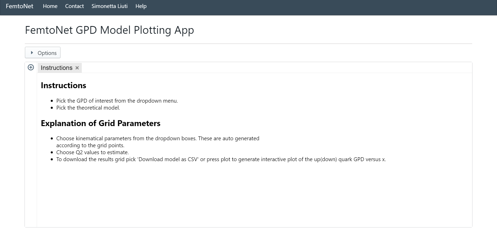
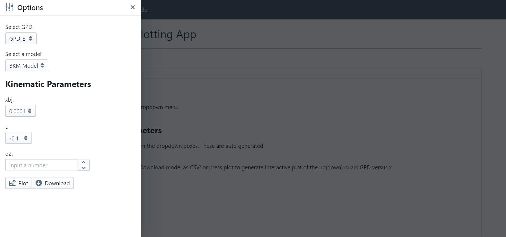
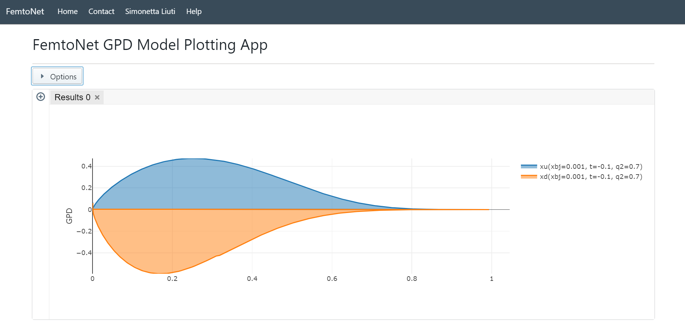
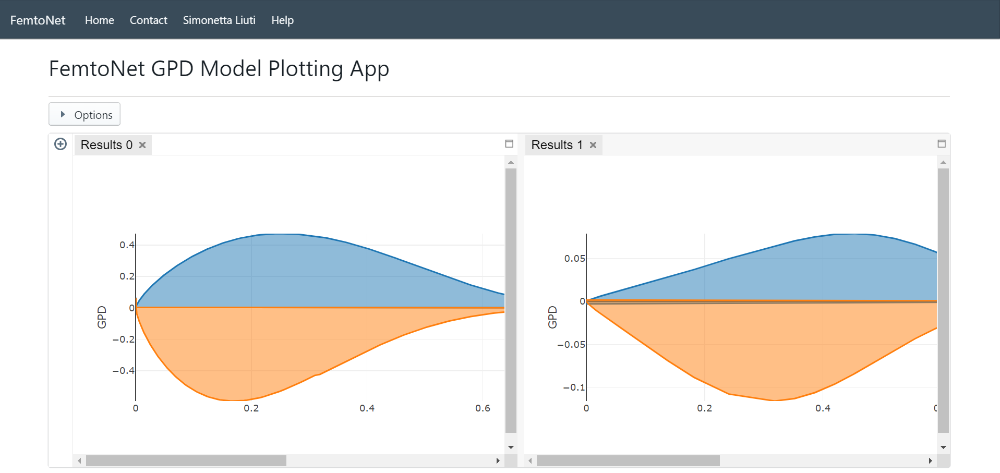

Web based interactive dasboard for visualizing Nuclear Femtography. The frontend of the dashboard was developed by Kevin Du, while the backend of the dashboard was developed by Dr. Joshua Hoskins. The dashboard pulls data from an API based on user parameters, and plots the data in a window. The user can also download the data in the form of a CSV file.

# Features
* Specify the xbj, t, q^2 arguments to fetch data from the API
* Choose from different models - UVA, BKM
* Plotting of the data fetched from the API
* Comparing two or more plots side by side
* Plotting a new graph on top of an existing one
* Download Data as a CSV

# Created using
* React.js
* Typescript
* Blueprint.js - React UI library
* Plot.ly - plotting library
* Flex-Layout - React library for dynamic dashboard

# Screenshots

